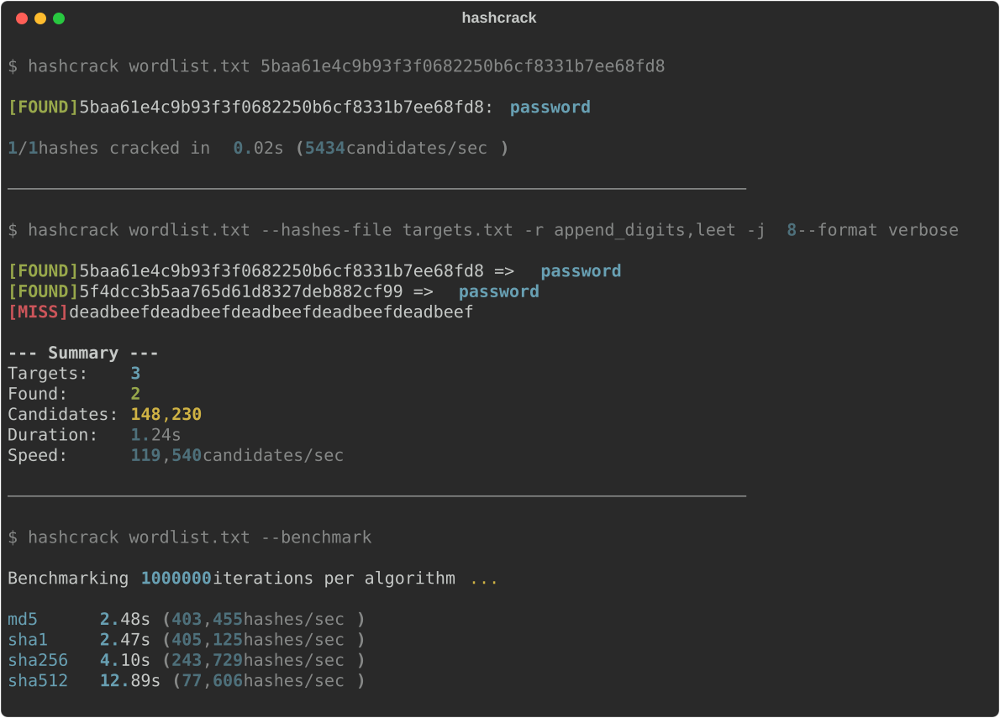

<div align="center">
  
  <h1>hashcrack</h1>
  <p><strong>Multi-algorithm, multi-threaded hash cracking tool written in Rust.</strong></p>
  <p>
    
    
    
  </p>
</div>

<br />

## Why hashcrack?

Most hash cracking tools are either bloated enterprise software or single-algorithm scripts. **hashcrack** started as a 40-line SHA-1 dictionary cracker and grew into a proper tool — multiple algorithms, parallel processing, mutation rules, salt support, checkpoint/resume — all in 12 files with zero runtime dependencies beyond Rust's standard library and a few focused crates.

---

## Table of Contents

- [Install](#install)
- [Quick Start](#quick-start)
- [Features](#features)
- [Commands](#commands)
- [Mutation Rules](#mutation-rules)
- [Output Formats](#output-formats)
- [Safety](#safety)
- [How It Works](#how-it-works)
- [Tech Stack](#tech-stack)
- [hashcrack vs Alternatives](#hashcrack-vs-alternatives)
- [Contributing](#contributing)
- [License](#license)

---

## Install

```bash
# From source
git clone https://github.com/TheDarkArtist/hashcrack.git
cd hashcrack
cargo build --release

# Binary at target/release/hashcrack
```

## Demo

<div align="center">
  
</div>

## Quick Start

```bash
# Auto-detects algorithm from hash length
hashcrack wordlist.txt 5baa61e4c9b93f3f0682250b6cf8331b7ee68fd8

# Specify algorithm + mutation rules
hashcrack wordlist.txt -a sha256 -r append_digits,leet <hash>

# Multiple targets, JSON output, 8 threads
hashcrack wordlist.txt --hashes-file targets.txt --format json -j 8

# Benchmark hashing speed
hashcrack wordlist.txt --benchmark
```

## Features

<table>
<tr>
<td width="50%">

**Multi-Algorithm**

MD5, SHA-1, SHA-256, SHA-512 with auto-detection from hash length. Adding a new algorithm means implementing one trait.

</td>
<td width="50%">

**Multi-Threaded**

Parallel wordlist processing via rayon across all CPU cores. Progress bar with live speed and ETA.

</td>
</tr>
<tr>
<td width="50%">

**Mutation Rules**

Generate candidate passwords from each word — leet speak, digit appending, case toggling, common suffixes. Stack rules with commas.

</td>
<td width="50%">

**Salt Support**

Crack salted hashes using `hash:salt` format. Configure salt position as prefix or suffix.

</td>
</tr>
<tr>
<td width="50%">

**Checkpoint & Resume**

Save progress on long-running sessions and resume later from exactly where you left off.

</td>
<td width="50%">

**Multiple Output Formats**

Normal, verbose, JSON, or quiet. Pipe JSON output to other tools for further processing.

</td>
</tr>
</table>

## Commands

| Option | Description |
|---|---|
| `<WORDLIST> <HASH>` | Crack a single hash (algorithm auto-detected) |
| `-a, --algo <ALGO>` | md5, sha1, sha256, sha512 |
| `-j, --threads <NUM>` | Number of threads (defaults to CPU count) |
| `-r, --rules <RULES>` | Comma-separated mutation rules |
| `--hashes-file <FILE>` | File with hashes to crack (one per line) |
| `--format <FORMAT>` | normal, quiet, verbose, json |
| `--ignore-case` | Case-insensitive hash comparison |
| `--salt-position <POS>` | prefix or suffix (default: prefix) |
| `--resume <FILE>` | Resume from checkpoint |
| `--benchmark` | Test hashing speed per algorithm |

## Mutation Rules

Rules generate candidate passwords from each word in the wordlist.

| Rule | What it does | `password` becomes |
|---|---|---|
| `append_digits` | Appends 0-9 | password0, password1, ... |
| `toggle_case` | UPPER + Capitalized | PASSWORD, Password |
| `leet` | a→4, e→3, i→1, o→0, s→5, t→7 | p455w0rd |
| `common_suffixes` | Appends !, 123, @, # | password!, password123 |
| `capitalize` | First letter uppercase | Password |
| `reverse` | Reverses the word | drowssap |

## Output Formats

**normal** — `hash:password` pairs with summary stats

**verbose** — tagged `[FOUND]`/`[MISS]` output with detailed summary

**json** — one JSON object per line, machine-readable

**quiet** — just the passwords, nothing else

## Safety

| Mechanism | Description |
|---|---|
| Authorized use only | This tool is for security testing on systems you own or have explicit permission to test |
| Read-only | hashcrack does not modify any files — it reads wordlists and outputs results |
| Checkpoint saves | Long sessions can be saved and resumed without losing progress |

## How It Works

The cracker loads the entire wordlist into memory, then uses rayon to parallelize iteration across all CPU cores. For each word, the mutation rules engine generates candidates, which are hashed and compared against a `HashSet` of targets for O(1) lookup. Algorithms implement a `HashAlgorithm` trait, selected at runtime by name or auto-detected from hash length. The architecture is 12 files, each doing one thing — cracker core, algorithm registry, rule engine, progress tracker, output formatters, checkpoint system.

## Tech Stack

<p>
  
  
  
  
</p>

## hashcrack vs Alternatives

| | hashcrack | John the Ripper | Simple Python script |
|---|---|---|---|
| Setup | `cargo build` | Complex install + config | `pip install` |
| Speed | Multi-threaded Rust | Fast (C) | Single-threaded, slow |
| Algorithms | 4 (extensible) | 100+ | Usually 1 |
| Mutation rules | Built-in, stackable | External rule files | Manual |
| Salt support | Built-in | Built-in | Usually not |
| Codebase | 12 files, readable | Massive | Simple but limited |

## Contributing

```bash
git clone https://github.com/TheDarkArtist/hashcrack.git
cd hashcrack
cargo build
cargo test
```

<details>
<summary><strong>Contributing Guidelines</strong></summary>

1. Fork the repo
2. Create a branch (`git checkout -b feature/my-thing`)
3. Make your changes
4. Run `cargo test` to verify
5. Open a PR

</details>

<details>
<summary><strong>Contributor Graph</strong></summary>
<p>
  <a href="https://github.com/TheDarkArtist/hashcrack/graphs/contributors">
    
  </a>
</p>
</details>

## License

[MIT](LICENSE)

<br />

<div align="center">
  <sub>Built by <a href="https://thedarkartist.in">TheDarkArtist</a></sub>
</div>
